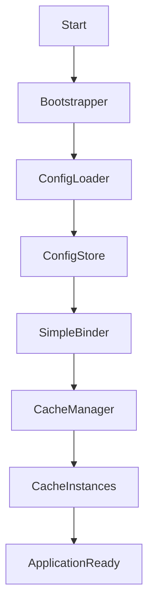

# Spring Boot property processing & custom cache design

## Overview
This document explains how Spring Boot loads and processes properties and shows a custom cache system inspired by that mechanism.

## Table of contents
- Overview
- How Spring Boot loads properties (step-by-step)
- Internal components (Environment, PropertySource, Binder, Auto-configuration)
- Property lifecycle flow
- Example: `spring.datasource.url`
- Designing a custom cache system
  - Goals
  - Architecture
  - Components
  - Example configuration
  - Implementation sketch
- Flowchart
- Next steps

## How Spring Boot loads properties (step-by-step)
(See assistant's earlier explanation for full details.)

## Internal components
- `Environment` / `ConfigurableEnvironment`
- `PropertySource`
- `ConfigDataEnvironmentPostProcessor` / `ConfigFileApplicationListener`
- `Binder` and `@ConfigurationProperties`
- Auto-configuration classes and conditionals

## Property lifecycle flow
1. `SpringApplication.run()` bootstraps the app.
2. `ConfigDataEnvironmentPostProcessor` reads `application.properties` / `application.yml`.
3. Loaded values become `PropertySource`s inside the `Environment`.
4. `Binder` binds prefixed properties into POJOs (`@ConfigurationProperties`).
5. Auto-configurations read those POJOs (or query `Environment`) to create beans.

## Designing a custom cache system
### Goals
- Load config from file
- Store properties in memory for fast access
- Support binding to typed config objects
- Auto-initialize caches at startup

### Architecture
- `ConfigLoader` — loads files into `Map<String,String>`
- `ConfigStore` — holds ordered `PropertySource`s and resolves keys
- `SimpleBinder` — binds prefixed keys into POJOs via reflection
- `CacheManager` — creates named caches using config from `ConfigStore`
- `Cache` — per-name in-memory cache with TTL
- `Bootstrapper` — runs at startup to wire everything

### Example configuration (config.properties)
```
cache.names=books,sessions
cache.books.ttl=30
cache.books.maxSize=100
cache.sessions.ttl=600
```

### Implementation sketch
See `src/main/java/com/example/customcache` in the project for a runnable sketch.

## Flowchart


## Next steps
- Run the demo and experiment with `ConfigStore.bind(...)` and `CacheManager`.
- Extend binder to support nested objects and relaxed binding.

